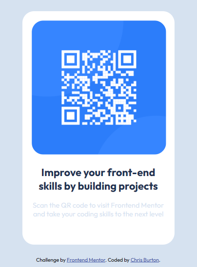

  # QR code component
  

  
  
  
  
  ## Description
  This is a challenge from Frontend Mentor to improve my CSS skills to create pages according to provied information.

  ### Tools and Languages used
  ##### Frontend:
  
   
  
  
  ##### Backend:
  None
  ##### Database:
  None
  ##### Tools:
  
  
  
  
  
  
  
  ## Screenshots
  

  ## Links
  GitHub Repository: https://github.com/wizzle13/qr-code

  GitHub URL: https://wizzle13.github.io/qr-code

  &copy;2023 by Chris Burton
